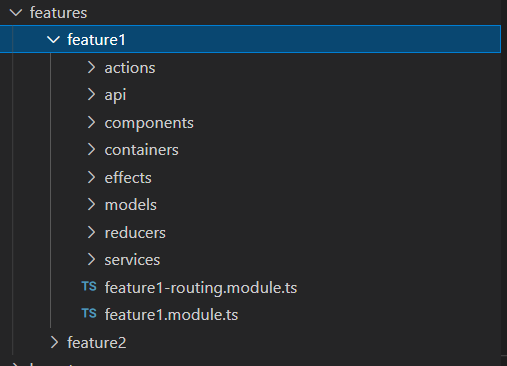

## Diagram

The following diagram represents the overall general flow of application state in NgRx.
Find More Here [https://v8.ngrx.io/](https://v8.ngrx.io/docs)

## Folder Structure

## Feature Module Structure

## Simple Version

[Simple version Link](https://github.com/baggelisp/Angular-Service-Layer-Architecture-Ngrx-Store/tree/feature/simple-version)

## Development server

Run `ng serve` for a dev server. Navigate to `http://localhost:4200/`. The app will automatically reload if you change any of the source files.
